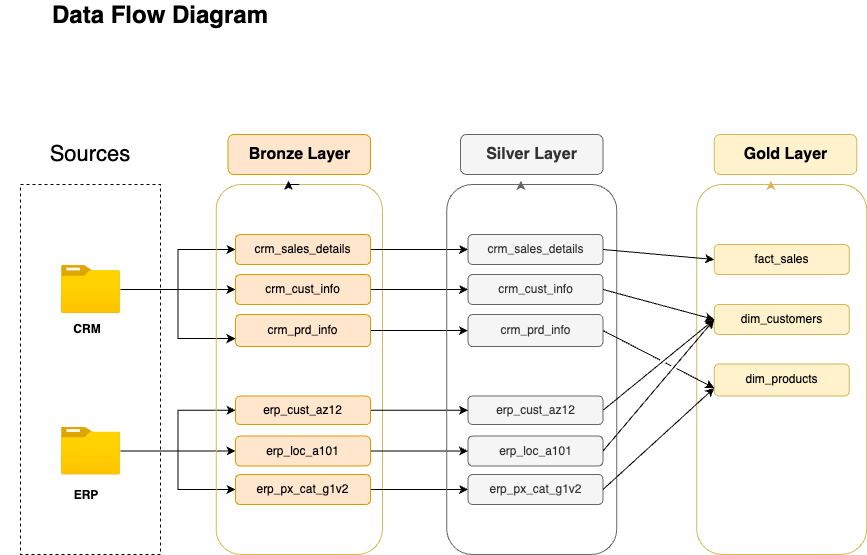

# Optimizing Data for Analytics: A SQL Data Warehouse & Pipeline Using Medallion Architecture

This project demonstrates a comprehensive data warehousing and analytics solution, from building a data warehouse to Analytics-Ready Insights. Here's a sneak peak of the raw data!

The data architecture for this project follows Medallion Architecture **Bronze**, **Silver**, and **Gold** layers:

1. **Bronze Layer**: Stores raw data as-is from the source systems. Data is ingested from CSV Files into SQL Server Database.
2. **Silver Layer**: This layer includes data cleansing, standardization, and normalization processes to prepare data for analysis.
3. **Gold Layer**: Houses business-ready data modeled into a star schema required for reporting and analytics.

---
## 📖 Project Overview

This project involves:

1. **Data Architecture**: Designing a Modern Data Warehouse Using Medallion Architecture **Bronze**, **Silver**, and **Gold** layers.
2. **ETL Pipelines**: Extracting, transforming, and loading data from source systems into the warehouse.
3. **Data Modeling**: Developing fact and dimension tables optimized for analytical queries.

## 📜 SQL Scripts

Stored procedures and schema definitions for each layer:

- **Bronze Layer**: `bronze_ddl.sql`, `proc_load_bronze.sql`
- **Silver Layer**: `silver_ddl.sql`, `proc_load_silver.sql`
- **Gold Layer**: `gold_products.sql`, `gold_sales.sql`, `gold_customers.sql`

